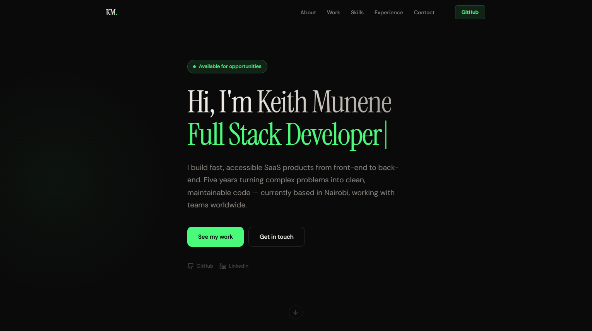
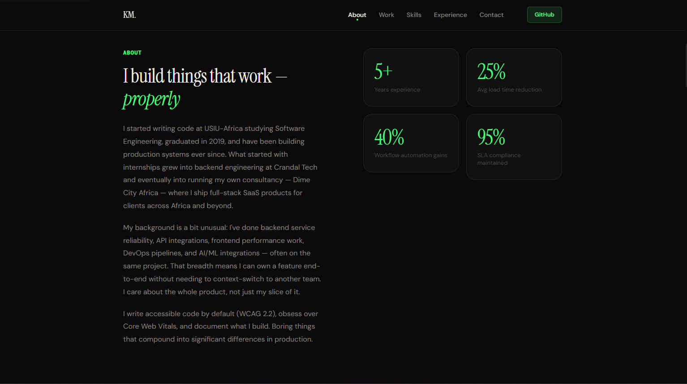
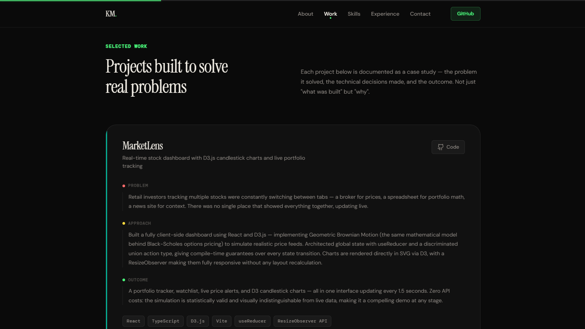
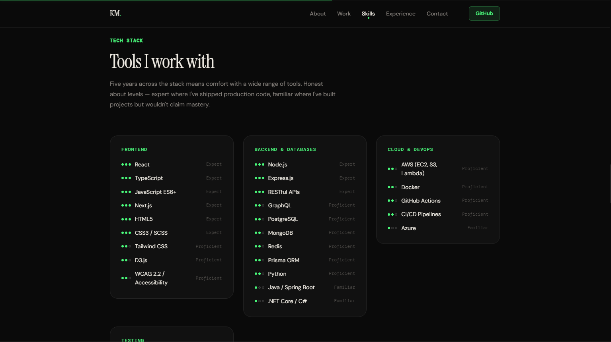
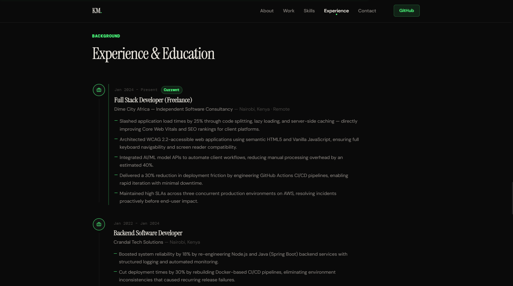
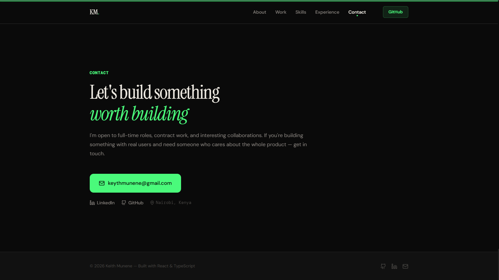

# Keith Munene — Portfolio







Personal portfolio website built with React, TypeScript, and Vite.

## Tech Stack
- React 18 + TypeScript
- Vite
- CSS Modules
- Lucide React (icons)
- IntersectionObserver API (scroll animations)

## Running Locally

```bash
npm install
npm run dev
```

Open http://localhost:5173

## Build

```bash
npm run build
npm run preview
```

## Deploy

Drag the `dist/` folder to [Netlify](https://netlify.com) or [Vercel](https://vercel.com) for free hosting.